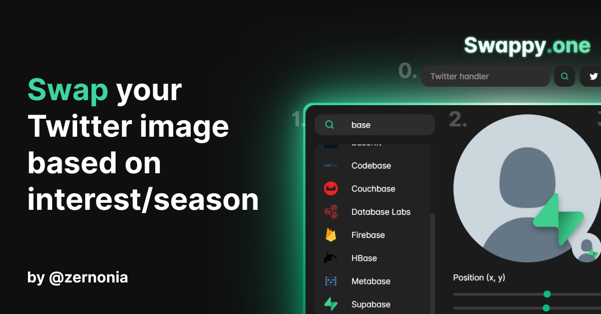

<!-- PROJECT LOGO -->
<br />
<p align="center">
  <a href="https://github.com/zernonia/swappy-one">
    
  </a>

  <h3 align="center">Swappy.one</h3>

  <p align="center">
  Simple & Fun project for <strong><a href="https://supabase.io/">Supabase</a> Holiday Hackdays!</strong>
    <br />
    Swap your Twitter image based on interest/season temporarily or forever!
    <br />
    <br />
    <a href="https://swappy.one">View Demo</a>
    ·
    <a href="https://github.com/zernonia/swappy-one/issues">Report Bug</a>
    ·
    <a href="https://github.com/zernonia/swappy-one/issues">Request Feature</a>
  </p>
</p>



## 🚀 Features

- 🎉 Add badges/frame to your Twitter profile
- 🤩 Share templates with your friends to enjoy this festive season
- 🔒 Only update your profile image
- 🤚 Customize the placement of element yourself

## 📇 About The Project

This project is inspired by Facebook's Temporary Profile Picture, as well as the Twitter Space's logo when someone is joining a Space. Thus, I've created this apps to swap your plain Twitter picture to fit the **season/event/anything** that you want your follower to notice!

After a certain amount of period (you can configure on the app), it will automatically **swap back** (hence, Swappy) to your original image. And you can revisit the app when you feel like putting on another badges in the future.

`Author: @zernonia`

### 🔨 Built With

- [Supabase](https://supabase.com/)
- [Vue 3](https://v3.vuejs.org/)
- [Vite](https://vitejs.dev/)
- [WindiCSS](https://windicss.org/)

### ⚡ Supabase Service

- Supabase Database
- Supabase Auth (Twitter)
- Supabase Storage
- Postgres Function

## 🌎 Local Development

=== WIP ===

### Prerequisites

Yarn

- ```sh
  npm install --global yarn
  ```

### Development

1. Clone the repo
   ```sh
   git clone https://github.com/zernonia/swappy-one.git
   ```
2. Install NPM packages
   ```sh
   yarn install
   ```
3. Run Development instance
   ```sh
   yarn dev
   ```

## ➕ Contributing

Contributions are what make the open source community such an amazing place to be learn, inspire, and create. Any contributions you make are **greatly appreciated**.

1. Fork the Project
2. Create your Feature Branch (`git checkout -b feature/AmazingFeature`)
3. Commit your Changes (`git commit -m 'Add some AmazingFeature'`)
4. Push to the Branch (`git push origin feature/AmazingFeature`)
5. Open a Pull Request

## 🙏 Acknowledgement

1. Fundamental for this Visualization ([Generate database types from OpenAPI specification](https://supabase.io/docs/reference/javascript/generating-types#generate-database-types-from-openapi-specification))
2. Guide to Construct Dynamic SVG Connector ([Connecting Table using SVG](https://codepen.io/alojzije/pen/ndfrI))
3. [Icones - icon gallery](https://icones.js.org/)

## 📈 Analytics

I'm using [Umami Analytics](https://umami.is/docs/about) because I'm interested in the distributions of user who uses Supabase and this tool.

[This](https://umami-zernonia.vercel.app/share/yzSUulXQ/Supabase%20Schema) is the public URL for the analytics. Enjoy!

## 📜 License

Not Associated with Supabase.

Distributed under the MIT License. See `LICENSE` for more information.

# 📧 Contact

Zernonia - [@zernonia](https://twitter.com/zernonia) - zernonia@gmail.com

Also, if you like my work, please buy me a coffee ☕😳

<a href="https://www.buymeacoffee.com/zernonia" target="_blank">
    
  </a>
